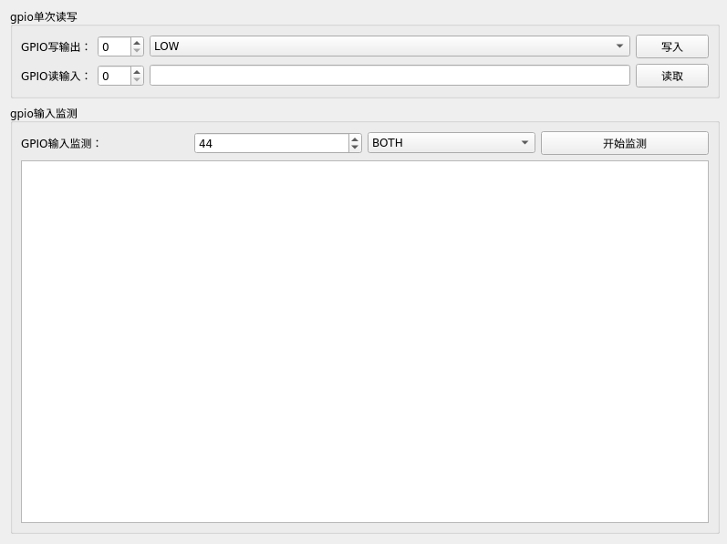

# GPIOTool
该项目是针对Linux系统下通用GPIO子系统驱动封装的一套应用层读写接口，内部使用sysfs接口。  
## 功能概述：
该模块分为三个类，GpioBase作为基类提供基础的gpio操作接口，GpioOutput和GpioInput继承自GpioBase，分别负责写IO和读IO。为了方便移植，这些类定义在一个文件模块中使用。  

注：因为Linux通用GPIO子系统已经涉及到底层硬件，所以权限要求比较严格，文件写入时需要root权限，所以该模块执行时的EUID(有效用户id)需要是root，如果无法满足的话，则可以修改GpioBase::autoElevateWritePermission常变量为true，作为应急方案解决。
## 接口函数：
```
GpioOutput://gpio输出类
    explicit GpioOutput(int gpioNum, QObject *parent = nullptr);
    bool setHigh();//设置高电平
    bool setLow();//设置低电平
    bool toggle();//电平翻转
GpioInput://gpio输入类
    explicit GpioInput(int gpioNum, QObject *parent = nullptr);
    int readOnce() const;//单次读取电平
    bool startMonitoring(Edge edge = BOTH);//启动边沿触发监控
    void stopMonitoring();//停止监控
    bool isMonitoring() const;
```
## 项目例程：  
  

## 作者联系方式:
**邮箱:justdoit_mqr@163.com**  
